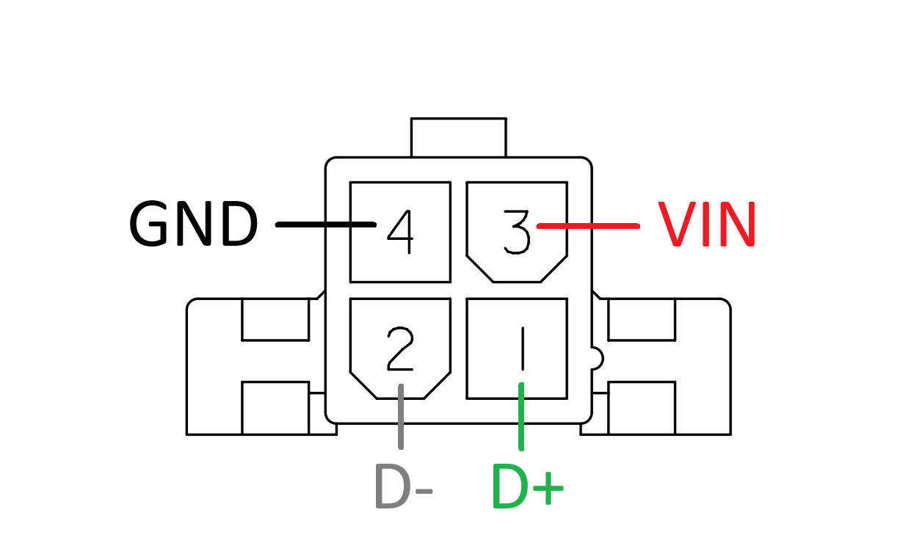

# Formula Student Korea Electric Energy Meter


## Features

* Records HV bus voltage and current, LV voltage and ambient (CPU) temperature
* 100 Hz data sampling rate
* Mounted as USB Mass Storage to PC when extracting records
* Records with real world time using internal RTC
* Data visualizer tool available on both web and desktop applications

## Specifications

| | MIN | TYP | MAX | UNIT |
|:-:|:-:|:-:|:-:|:-:|
| Supply voltage<sup>1</sup> | 6 | | 28 | V |
| Power consumption | | 0.5 | 1 | W |
| HV bus voltage | 0 | | 600 | V |
| HV bus voltage resolution | | 0.24 | | V |
| HV bus current | -750 | | 750 | A |
| HV bus current resolution | | 0.64 | | A |
| Operational temperature | -10 | | 80 | °C |
| IP rating | | IP 20 | | |
| Startup time |  | 550 | 700 | ms |
| Record interval |  | 10 | 15 | ms |
| Possible data loss<br>on power brownout | 0 | | 100 | ms |

<sup>1</sup> When powered by USB, the device could startup with a minimum supply voltage of 4.5 V.

## Connectors

| | LV | HV |
|:-:|:-:|:-:|
| Image |  |  |
| Model | [T4145415051-001](https://www.te.com/en/product-T4145415051-001.html) | [39291028](https://www.molex.com/en-us/products/part-detail/39291028) |
| Mate | [T4111402051-000](https://www.te.com/en/product-T4111402051-000.html) | [5557-02](https://www.molex.com/en-us/part-list/5557?physical_circuitsMaximum=%222%22&physical_numberOfRows=%222%22) |
| Pinout | 1: `D-`<br>2: `D+`<br>3: `5VOUT`<sup>1</sup><br>4: `VIN`<br>5: `GND` | 1: `HV+`<br>2: `HV-` |

<sup>1</sup> `5VOUT` is not used by the device. It outputs 5V and can drive current up to 800mA.

### Wiring

> [!CAUTION]
> Misconnection of the pins may cause permanent damage to the device.

> [!WARNING]
> When powered by USB, 5V rail of the USB must be connected to `VIN`, not `5VOUT`.


## Usage

TODO

## DIY

### Hardware

[device/hardware/jlcpcb/production_files/](https://github.com/luftaquila/fsk-energymeter/tree/main/device/hardware/jlcpcb/production_files) directory includes gerber, BOM and CPL files for the JLCPCB PCBA(SMT) order.

> [!TIP]
> Exclude through-hole components (HV and LV connector, debug pin header and `L01Z600S05` Hall sensor) from the SMT assembly list. Purchase these parts from the global suppliers and solder it yourself to purchase them cheaper and reduce the setup fee.

### Firmware

Download the latest `fsk-energymeter-firmware-<version>.zip` from the [Release](https://github.com/luftaquila/fsk-energymeter/releases) and upload the `firmware-release.elf` to the device via ST-Link.

You may use [STM32CubeProgrammer](https://www.st.com/en/development-tools/stm32cubeprog.html) or [OpenOCD for Windows](https://gnutoolchains.com/arm-eabi/openocd/) to upload an ELF file.

Take a look at the OpenOCD script [device/firmware/fsk-energymeter.cfg](https://github.com/luftaquila/fsk-energymeter/blob/main/device/firmware/fsk-energymeter.cfg) if you are using OpenOCD.

## Development

### Firmware

#### Prerequisites

1. Make sure following executables are in the `$PATH`.
    * arm-none-eabi-gcc
    * openocd
    * make

* Common
    * [Arm GNU Toolchain (**AArch32 bare-metal target (arm-none-eabi)**)](https://developer.arm.com/downloads/-/arm-gnu-toolchain-downloads)
* Windows
    * [OpenOCD for Windows](https://gnutoolchains.com/arm-eabi/openocd/)
    * [Make for Windows](https://gnuwin32.sourceforge.net/packages/make.htm)
* MacOS
    ```sh
    brew install make openocd
    ```
* Linux
    ```sh
    sudo apt-get install build-essential openocd
    ```

2. Clone repository
    ```sh
    git clone https://github.com/luftaquila/fsk-energymeter.git --recursive
    ```

#### Build and upload

```sh
cd fsk-energymeter/device/firmware
make program  # release build
make debug    # debug build
```

### Viewer

#### Prerequisites

1. [Node.js](https://nodejs.org/en/download/package-manager) >= v20
2. [Rust](https://www.rust-lang.org/tools/install) >= 1.81.0
3. Clone the repository and install dependencies
    ```sh
    git clone https://github.com/luftaquila/fsk-energymeter.git --recursive
    cd fsk-energymeter/viewer/web
    npm install
    cd ../native
    npm install
    ```

#### Build and run

* Web
    ```sh 
    cd fsk-energymeter/viewer/web
    python -m http.server 80  # open http://localhost
    ```

* Native
    ```sh
    cd fsk-energymeter/viewer/native
    npm run tauri dev    # run
    npm run tauri build  # build executables
    ```

## Troubleshootings

#### 1. FSK-EEM USB Mass Storage took too much time to be mounted on the PC
FSK-EEM uses the STM32F401, which implements a USB Full Speed PHY. It is decades-old technology with a maximum transfer speed of 12 Mbit/s. However, in the real world, the actual speed is around 4 Mbit/s or 0.5 MB/s. When you plug the FSK-EEM to your PC, the host(PC) will try to load the FAT table of the SD Card into its memory. Since the FAT32's FAT table is around 8 MB in size, it will take ~20 seconds for the FSK-EEM to be successfully mounted on the host computer. This is a hardware limitation in exchange of the lower cost. The RTC sync or record delete functions will work immediately regardless of this limit.

## LICENSE

```
"THE BEERWARE LICENSE" (Revision 42):
LUFT-AQUILA wrote this project. As long as you retain this notice,
you can do whatever you want with this stuff. If we meet someday,
and you think this stuff is worth it, you can buy me a beer in return.
```
