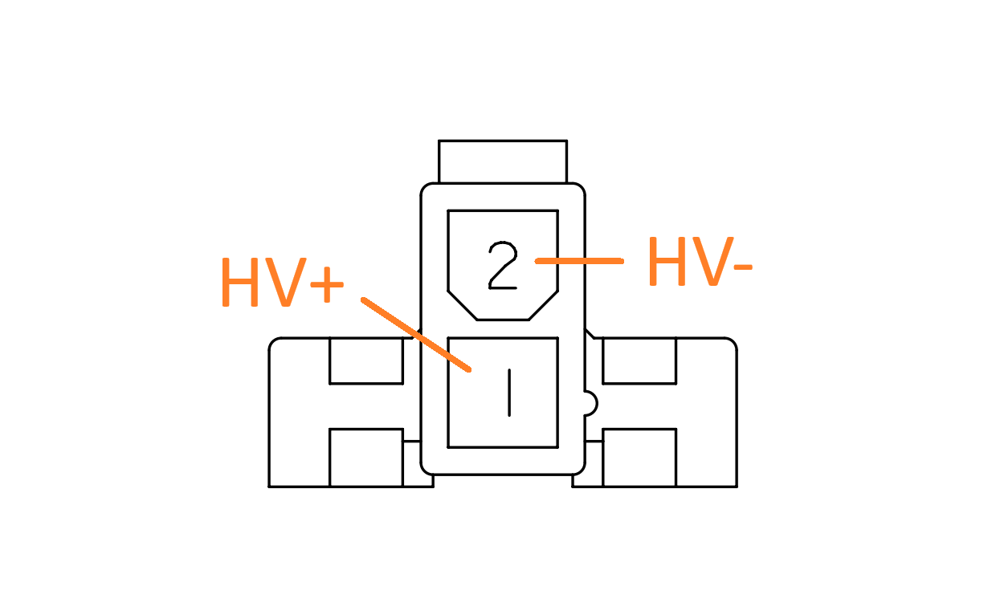

# Formula Student Korea Electric Energy Meter


## Features

* Records the following values:
    * HV bus voltage 
    * HV bus current
    * LV supply voltage 
    * Ambient (CPU) temperature
    * Real-world time of each records
* 100 Hz data sampling rate
* Mounted as a USB Mass Storage device
* Data visualizer available on most platforms

## Specifications

| | MIN | TYP | MAX | UNIT |
|:-:|:-:|:-:|:-:|:-:|
| Supply voltage<sup>1</sup> | 6 | | 28 | V |
| Power consumption | | 0.25 | 0.5 | W |
| HV bus voltage | 0 | | 600 | V |
| HV bus voltage resolution | | 0.24 | | V |
| HV bus current | -750 | | 750 | A |
| HV bus current resolution | | 0.64 | | A |
| Operational temperature | -10 | | 80 | °C |
| IP rating | | IP 20 | | |
| Startup time |  | 570 | 700 | ms |
| Record interval |  | 10 | 15 | ms |
| Possible data loss<br>on power brownout | 0 | | 100 | ms |

<sup>1</sup> When powered by USB, the device can startup with a minimum supply voltage of 4.5 V.

## Connectors

| | LV | HV |
|:-:|:-:|:-:|
| Model | [T4145415051-001](https://www.te.com/en/product-T4145415051-001.html) | [39291028](https://www.molex.com/en-us/products/part-detail/39291028) |
| Image |  |  |
| Mate | [T4111402051-000](https://www.te.com/en/product-T4111402051-000.html) | [5557-02](https://www.molex.com/en-us/part-list/5557?physical_circuitsMaximum=%222%22&physical_numberOfRows=%222%22) |
| Pinout | 1: `D-`<br>2: `D+`<br>3: `5VOUT`<sup>1</sup><br>4: `VIN`<br>5: `GND` | 1: `HV+`<br>2: `HV-` |

<sup>1</sup> `5VOUT` is not used by the device. It outputs 5V and can drive current up to 800mA.

### Wiring

> [!CAUTION]
> Misconnection of the pins may cause permanent damage to the device.

> [!WARNING]
> When powered by USB, 5V rail of the USB must be connected to `VIN`, not `5VOUT`.


## Usage

There are 2 operation modes in the FSK-EEM device. When the FSK-EEM is in startup, it measures the LV supply voltage and decide the mode to run.

### Record mode
If `VIN >= 6V` during startup, the device enters the Record mode.

The device will measure HV voltage, HV current, LV voltage and the CPU temperature every 10 ms and save it to the file.

> [!IMPORTANT]
> The device will perform a zero calibration of the HV voltage and current during the startup sequence.\
> Make sure that the HV voltage and current are at 0V and 0A until the the startup is complete.

### USB mode
If `VIN < 6V` during startup, the device enters the USB mode.

When plugged in, the FSK-EEM USB Mass Storage will appear on the host PC. It may took ~20 seconds to be mounted. See [Troubleshootings](https://github.com/luftaquila/fsk-energymeter?tab=readme-ov-file#1-fsk-eem-usb-mass-storage-takes-too-long-to-be-mounted-on-the-pc) for the details.

The recorded log files are stored in the drive like a standard USB memory stick.

> [!NOTE]
> The drive is **read-only**. You cannot edit or delete the log files in the explorer.

> [!IMPORTANT]
> The timestamp part at the beginning of the log file's name is important to calculate the actual timestamp.<br>
> Do NOT edit the filename of the *.log file. JSON or CSV files are not affected.

### FSK-EEM Viewer

Download the latest FSK-EEM Viewer from the [Release](https://github.com/luftaquila/fsk-energymeter/releases).

Open the record file in the FSK-EEM Viewer to visualize the data or export as a human-readable format.

#### Device Configuration Tab

Click the `Connect` button and select the FSK-EEM device to connect.\
The device's UID and the current time will be displayed when connected.

* `Sync RTC` button synchronizes the device clock with the host.
* `Delete` button deletes the all log files stored in the device.

## DIY

### Hardware

Download the latest `fsk-energymeter-pcb-<version>.zip` from the [Release](https://github.com/luftaquila/fsk-energymeter/releases). The *gerbers/* directory includes the gerber, BOM and CPL files for the JLCPCB PCBA(SMT) order.

> [!TIP]
> Exclude through-hole components (HV and LV connector, debug pin header and `L01Z600S05` Hall sensor) from the SMT assembly list. Purchase these parts from the global suppliers and solder it yourself to purchase them cheaper and reduce the setup fee.

### Firmware

Download the latest `fsk-energymeter-firmware-<version>.zip` from the [Release](https://github.com/luftaquila/fsk-energymeter/releases) and upload the `firmware-release.elf` to the device via ST-Link.

## Development

### Firmware

#### Prerequisites

1. Make sure following executables are in the `$PATH`.
    * arm-none-eabi-gcc
    * openocd
    * make

* Common
    * [Arm GNU Toolchain (**AArch32 bare-metal target (arm-none-eabi)**)](https://developer.arm.com/downloads/-/arm-gnu-toolchain-downloads)
* Windows
    * [OpenOCD for Windows](https://gnutoolchains.com/arm-eabi/openocd/)
    * [Make for Windows](https://gnuwin32.sourceforge.net/packages/make.htm)
* MacOS
    ```sh
    brew install make openocd
    ```
* Linux
    ```sh
    sudo apt-get install build-essential openocd
    ```

2. Clone repository
    ```sh
    git clone https://github.com/luftaquila/fsk-energymeter.git --recursive
    ```

#### Build and upload

```sh
cd fsk-energymeter/device/firmware
make program  # release build
make debug    # debug build
```

### Viewer

#### Prerequisites

1. [Node.js](https://nodejs.org/en/download/package-manager) >= v20
2. [Rust](https://www.rust-lang.org/tools/install) >= 1.81.0
3. Clone the repository and install dependencies
    ```sh
    git clone https://github.com/luftaquila/fsk-energymeter.git --recursive
    cd fsk-energymeter/viewer/web
    npm install
    cd ../native
    npm install
    ```

#### Build and run

* Web
    ```sh 
    cd fsk-energymeter/viewer/web
    python -m http.server 80  # open http://localhost
    ```

* Native
    ```sh
    cd fsk-energymeter/viewer/native
    npm run tauri dev    # run
    npm run tauri build  # build executables
    ```

## Troubleshootings

#### 1. FSK-EEM USB Mass Storage takes too long to be mounted on the host
The FSK-EEM uses the STM32F401, which implements a USB Full Speed PHY. It is decades-old technology with a maximum transfer speed of 12 Mbit/s. However, in the real world, the actual speed is around 4 Mbit/s or 0.5 MB/s.

When you plug the FSK-EEM device, the host(PC) will try to load the FAT table of the SDMMC into its memory. The size of the FAT32 FAT table is around 8 MB, so it will take ~20 seconds for the FSK-EEM to be successfully mounted on the host computer. This is a hardware limitation in exchange of the lower cost.

The RTC sync or record delete functions will work immediately regardless of this limit.

#### 2. `Web Serial API not supported` error on the FSK-EEM Viewer.

FSK-EEM Viewer's Device Configuration tab uses the Web Serial API to talk with the device, which has [limited support](https://caniuse.com/?search=Web%20Serial%20API) across the platforms and browsers.

On MacOS, the native app uses the Safari for its WebView, which does not supports the API. The web version(URL or html file) of the FSK-EEM Viewer will work on the Chrome browser.

On Android and iOS, the API is not supported from the OS layer. Use the desktop version of the viewer to configure the device.

## LICENSE

```
"THE BEERWARE LICENSE" (Revision 42):
LUFT-AQUILA wrote this project. As long as you retain this notice,
you can do whatever you want with this stuff. If we meet someday,
and you think this stuff is worth it, you can buy me a beer in return.
```
