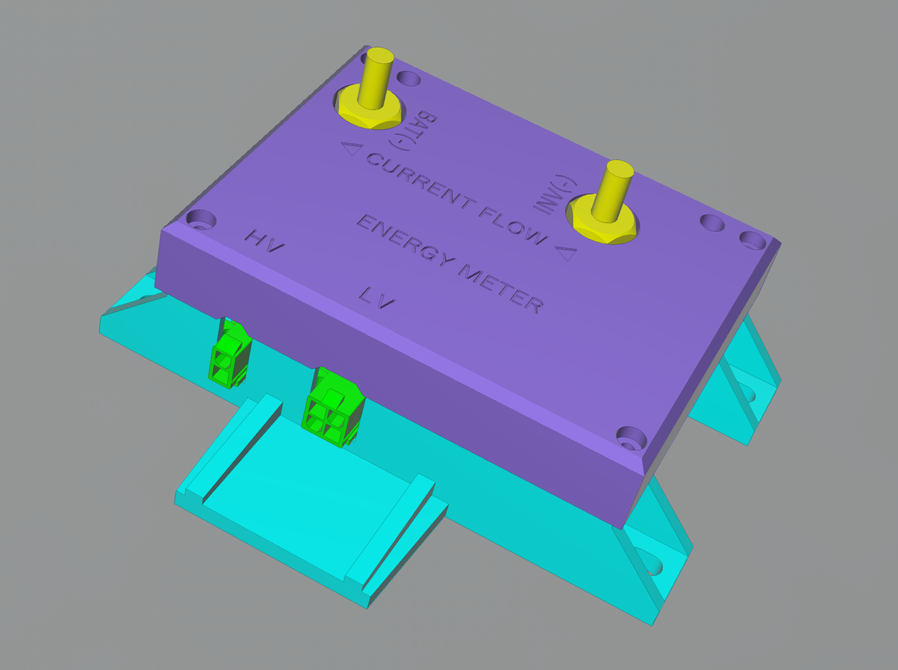
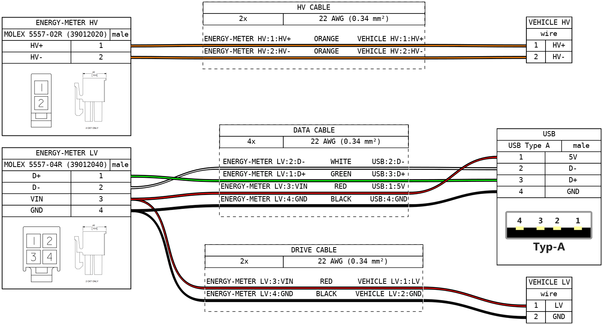

# Formula Student Korea Electric Energy Meter

<p align="center">
  
  &ensp;
  
</p>

## 0. Features

* 100 Hz data recording
  * HV bus voltage 
  * HV bus current
  * LV supply voltage 
  * Ambient (CPU) temperature
  * Real-world time of each record
* USB Mass Storage data extraction
* Web-based data viewer

## 1. Specifications

| | MIN | TYP | MAX | UNIT |
|:-:|:-:|:-:|:-:|:-:|
| Supply voltage<sup>1</sup> | 6 | | 28 | V |
| Power consumption | | 0.25 | 0.5 | W |
| HV bus voltage | 0 | | 600 | V |
| HV bus voltage resolution | | 0.24 | | V/LSB |
| HV bus current | -750 | | 750 | A |
| HV bus current resolution | | 0.32 | | A/LSB |
| Operational temperature | -10 | | 80 | °C |
| IP rating | | IP 20 | | |
| Startup time | | 550 | | ms |
| Record interval | | 10 | 15 | ms |
| Possible data loss<br>on power brownout | 0 | | 100 | ms |

<sup>1</sup> When powered by USB, the device can startup with a minimum supply voltage of 4.5 V.

## 2. Connectors

> [!NOTE]
> The HV current measurement terminals at the top of the device are standard-pitch M6 brass bolts.

| | LV | HV |
|:-:|:-:|:-:|
| Model | [Molex 5569-04A1 (39291048)](https://www.molex.com/en-us/products/part-detail/39291048) | [Molex 5569-02A1 (39291028)](https://www.molex.com/en-us/products/part-detail/39291028) |
| Image |  |  |
| Mate | [Molex 5557-04R (39012040)](https://www.molex.com/en-us/products/part-detail/39012040) | [Molex 5557-02R (39012020)](https://www.molex.com/en-us/products/part-detail/39012020)  |
| Pinout | 1: `D+` &ensp; 2: `D-`<br>3: `VIN` &ensp; 4: `GND` | 1: `HV+` &ensp; 2: `HV-` |

> [!TIP]
> The crimp terminal for the Molex 5557 Series is [Molex 5556T (39000038)](https://www.molex.com/en-us/products/part-detail/39000038).

### Wiring



The _data cable_ and the _drive cable_ are two distinct cables.
When driving the vehicle, connect the _drive cable_ to the LV connector of the device.
To extract data, disconnect the _drive cable_ and connect the _data cable_ instead.

> [!CAUTION]
> Misconnection of the pins may cause permanent damage to the device.

> [!TIP]
> The easiest way to make a data cable is to cut a USB cable with Type-A connector on one end.

## 3. Usage

### 3-1. Record data

When driving the vehicle, connect both _HV cable_ and _drive cable_ to the device. The _drive cable_ should supply `VIN >= 6V` to start recording.

Once the device is powered up, it performs a zero calibration of the HV voltage and current. After calibration, it continuously measures data every 10 ms.

The measured data is updated to the file every 100 ms. During the file update, next measurement may be delayed by up to 5 ms.

A new log file is created with each power cycle. Each log file corresponds to a single power session.

> [!IMPORTANT]
> For the precise calibration, make sure that the HV voltage and current are at 0V and 0A until the startup is complete (typically 550 ms).

> [!NOTE]
> The device has an internal clock that tracks real-world time.
> Since the clock drifts over time, synchronize it with the FSK-EEM Viewer after a long period of non-use.
> If the time keeps resetting to `May 12, 2099`, the battery should be replaced.

### 3-2. Extract data

To extract the recorded data from the device, disconnect _drive cable_ and connect _data cable_ instead.
There is no need to disconnect the _HV cable_ during data extraction.

Plug the USB side of the _data cable_ to the PC or smartphone (with a Type-A to C adapter).
The FSK-EEM USB Mass Storage will appear [shortly](https://github.com/luftaquila/fsk-energymeter?tab=readme-ov-file#6-troubleshootings).

The log files are stored in the drive like a common USB memory. Copy the files to your PC.

> [!NOTE]
> The drive is ***read-only***; you cannot edit or delete the stored logs with the file explorer.

### 3-3. View data

Go to the [online viewer](https://fsk-energymeter.luftaquila.io) and open the log file to view a graph of the recorded data, or export it in a human-readable JSON/CSV format.

> [!TIP]
> If there is no Internet connection, download html or executable from the [release](https://github.com/luftaquila/fsk-energymeter/releases/latest) in advance.

### 3-4. Configure the device

In the viewer's Device Configuration section, click `Connect` and select the device to connect.

The device's UID and the current time will be displayed on successful connection.

* `Sync RTC`: Synchronizes the device clock with the host computer.
* `Delete`: Erases ***ALL*** files stored in the device.

Unplug and reconnect the device to see the change after deletion.

> [!WARNING]
> The delete action ***cannot be undone***.

## 4. DIY

### 4.1 Build hardware

1. Download `fsk-energymeter-pcb.zip` from the [latest release](https://github.com/luftaquila/fsk-energymeter/releases/latest) and extract it.
2. Place a JLCPCB PCBA (SMT) order using the GERBER, BOM and CPL files at the *gerbers/* directory.
3. Solder following parts manually to the device after the PCB arrives.
    * [L01Z600S05](https://www.eleparts.co.kr/goods/view?no=261774) Hall sensor
    * [5557-02A1](https://www.eleparts.co.kr/goods/view?no=25304) HV connector
    * [5569-04A1](https://www.eleparts.co.kr/goods/view?no=25303) LV connector
    * [2.54mm 2\*4 debug pin header](https://www.eleparts.co.kr/goods/view?no=12534585)
4. Insert the CR1220 battery and Micro SD card into the PCB.

### 4.2 Upload firmware

1. Download `fsk-energymeter-firmware.zip` from the [latest release](https://github.com/luftaquila/fsk-energymeter/releases/latest) and extract it.
1. Connect `3V3`, `GND`, `SWCLK`, `SWDIO` pins of the ST-Link to the corresponding pins on the device's debug pin header.
1. Run `flash.bat` to flash the release firmware to the device.

### 4.3 3d-print housing

1. Download `fsk-energymeter-3d.zip` from the [latest release](https://github.com/luftaquila/fsk-energymeter/releases/latest) and extract it.
2. 3d-print both `top.stl` and `bottom.stl` files.

### 4.4 Final assembly

1. Prepare 1x busbar, 2x M6 nuts, and 2x 40mm M6 brass bolts for the current measurement line.
    * The busbar and nuts need to be CNC-machined. The recommended material is C11000 copper alloy.
    * The 3D model of the busbar is at `fsk-energymeter-3d.zip`.
2. Prepare 5x 5mm M3 bolts and 4x 20mm M3 bolts for PCB and housing assembly.
3. Insert the busbar through the Hall sensor and secure it with the M6 bolts and nuts.
4. Place the PCB-busbar assembly into the housing and assemble the housing and cover.

> [!IMPORTANT]
> The HV current path is through the M6 nuts and the busbar. The M6 bolts are not intended to carry HV current.\
> Therefore, the nuts must be thick enough to handle the current and provide sufficient contact area, and tall enough to be exposed above the housing cover.

## 5. Development

> [!NOTE]
> This section is *NOT REQUIRED* in general, and is for developers who want to modify the software on their own.

<details>
<summary>click to expand</summary>

### 5-1. Firmware

#### Prerequisites

1. Clone repository
    ```sh
    git clone https://github.com/luftaquila/fsk-energymeter.git --recursive
    ```

2. Make sure the `arm-none-eabi-gcc`, `openocd` and `make` executables are in the `$PATH`.
    * Common
        * [Arm GNU Toolchain (**AArch32 bare-metal target (arm-none-eabi)**)](https://developer.arm.com/downloads/-/arm-gnu-toolchain-downloads)
    * Windows
        * [OpenOCD for Windows](https://gnutoolchains.com/arm-eabi/openocd/)
        * [Make for Windows](https://gnuwin32.sourceforge.net/packages/make.htm)
    * macOS
        ```sh
        brew install make openocd
        ```
    * Linux
        ```sh
        sudo apt-get install build-essential openocd
        ```

#### Build and upload

```sh
cd fsk-energymeter/device/firmware
make program  # release build
make debug    # debug build
```

### 5-2. Viewer

#### Prerequisites

1. [Node.js](https://nodejs.org/en/download/package-manager) >= v20
2. Clone the repository and install dependencies
    ```sh
    git clone https://github.com/luftaquila/fsk-energymeter.git --recursive
    cd fsk-energymeter/viewer
    npm install
    ```

#### Build and run

```sh 
cd fsk-energymeter/viewer
npm run dev          # development server at http://localhost:9400
npm run build        # production build for Docker image 
npm run build:dev    # production build with no base url
npm run build:single # single file html build
```

</details>

## 6. Troubleshootings

#### 1. FSK-EEM USB Mass Storage takes too long to be mounted
The device only supports USB Full Speed (USB 1.1) spec. It is decades-old technology with a maximum transfer speed of 12 Mbps.
However, in the real world, the actual speed is around 4 Mbps (0.5 MB/s).

When the device is connected to the host PC, the host will try to load the FAT table of the SDMMC.
The FAT32 FAT table is typically a few megabytes, so it will take ~20 seconds to mount.

To reduce the mount time, format SD cards with larger cluster sizes.
The RTC sync or record delete functions will work immediately regardless of this limit.

#### 2. `Web Serial API not supported` error on the FSK-EEM Viewer.

The FSK-EEM Viewer's Device Configuration tab uses the Web Serial API to talk with the device, which has [limited support](https://caniuse.com/?search=Web%20Serial%20API) across the platforms and browsers.

## 7. DISCLAIMER

> [!IMPORTANT]
> 차량기술규정 및 출력제한 위반 여부는 대회장에서 제공하는 공식 에너지미터로만 판단합니다.
> 그 밖의 에너지미터는 제조 공정의 차이 등으로 인해 공식 장치와 측정값이 상이할 수 있음을 반드시 인지해야 합니다.
> 이러한 에너지미터는 대회 중에는 사용할 수 없으며, 차량 제작 시 단순 참고용으로만 활용해야 합니다.

## 8. LICENSE

For non-commercial use only:

```
"THE BEERWARE LICENSE" (Revision 42):
LUFT-AQUILA wrote this project. As long as you retain this notice,
you can do whatever you want with this stuff. If we meet someday,
and you think this stuff is worth it, you can buy me a beer in return.
```

이 저장소의 모든 내용물은 비상업적 용도에 한해 얼마든지 자유롭게 사용할 수 있습니다.\
이 프로젝트가 마음에 든다면, 언젠가 우리가 만나게 되었을 때 맥주 한 잔 사 주세요.
